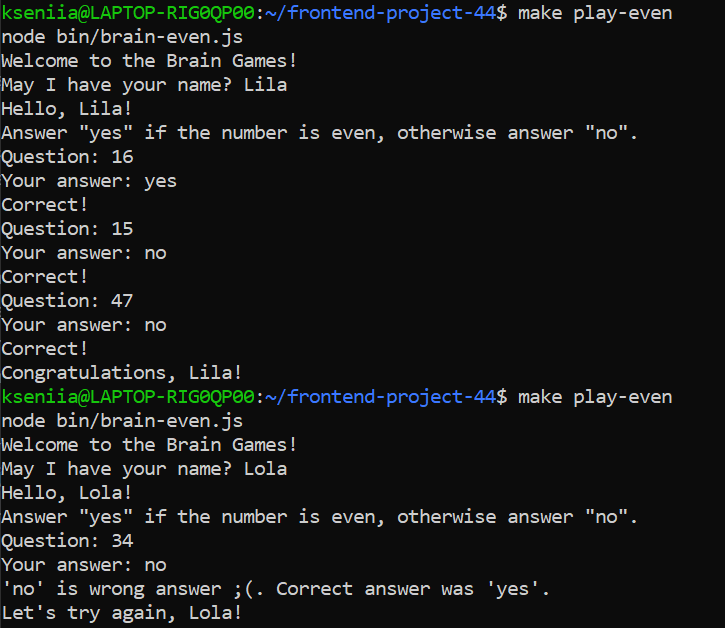
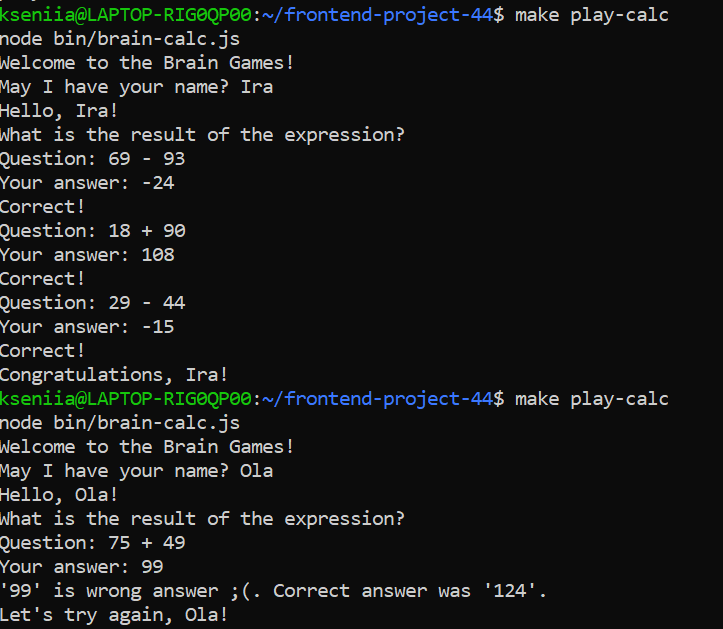
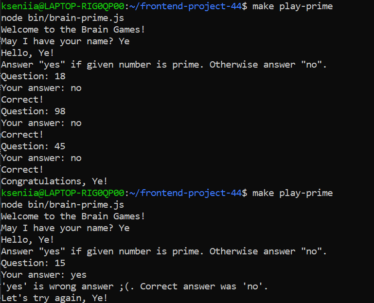

### Hexlet tests and linter status:

Games:
brain-even: 

brain-calc: 

brain-gcd: 

brain-progression: 

brain-prime: 

Play games with Makefile:
make play-even     
make play-calc    
make play-gcd
make play-progression
make play-prime

